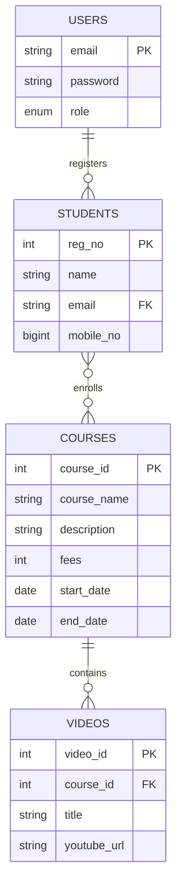

<div align="center">

# 👑 Student Portal & Admin Panel

### A Modern Full-Stack Learning Management System

  <br>

  <div>
    
    
    
    
  </div>

  <br>

  <a href="https://github.com/yourusername/student-portal/wiki">📖 Documentation</a>

  <br><br>
</div>

---

## ⚡ Quick Start

```bash
# Clone & Setup
git clone https://github.com/yourusername/student-portal.git && cd student-portal

# Backend
cd project1 && npm install && npm start

# Frontend
npm install && npm run dev

# App running at http://localhost:5173
```

---

## 📸 Visual Showcase

<div align="center">

| Home Page | Admin Dashboard | Video Player |
|:---------:|:---------------:|:------------:|
|  |  |  |

</div>

---

## ✨ Features

### 👨‍🎓 Student Experience
| Feature | Description |
|---------|-------------|
| 🔐 JWT Authentication | Secure login & session management |
| 📚 Course Catalog | Browse active courses with smart filtering |
| 🎯 One-Click Enrollment | Instant course registration |
| ▶️ YouTube Integration | Seamless video streaming |
| 📱 Fully Responsive | Works on all devices |

### 👨‍💼 Admin Superpowers
| Feature | Description |
|---------|-------------|
| 📊 Analytics Dashboard | Overview of courses & students |
| 🎓 Course CRUD | Full course management |
| 👥 Student Management | Filter & manage enrolled students |
| 🎬 Video Management | Add/edit/delete course videos |
| 🔒 Role-Based Access | Admin-only protected routes |

---

## 🏗️ Technology Stack

### Frontend
<div align="center">

| Technology | Version |
|------------|---------|
| React | 18.2.0 |
| Vite | 5.0.0 |
| Tailwind CSS | 3.3.0 |
| React Router | 6.8.0 |
| Axios | 1.4.0 |

</div>

### Backend
<div align="center">

| Technology | Version |
|------------|---------|
| Node.js | 18.0.0 |
| Express | 4.18.0 |
| MySQL2 | 3.6.0 |
| JWT | 9.0.0 |

</div>

---

## 🗄️ Database Schema



---

## 🔌 API Endpoints

### Authentication
```
POST /api/auth/login
POST /api/auth/register
```

### Student
```
GET  /api/student/all-courses
GET  /api/student/my-courses
PUT  /api/student/change-password
```

### Admin
```
POST /api/admin/addCourse
GET  /api/admin/enrolled-students
```

---

## 🚀 Development Guide

### Environment Setup
```bash
# Backend: project1/.env
DB_HOST=localhost
DB_USER=root
DB_PASSWORD=yourpassword
DB_NAME=learning_platform
JWT_SECRET=your-super-secret-jwt-key-min-32-chars!
PORT=4000

# Frontend: .env
VITE_API_URL=http://localhost:4000
```

### Commands
```bash
# Development
cd project1 && npm run dev    # Backend
npm run dev                   # Frontend

# Production
npm run build                 # Frontend build
pm2 start project1/server.js --name "student-portal"  # Backend with PM2
```

---

## 💻 Usage & Testing

### Test Flow
1. Visit Home Page → View courses
2. Register → Create student account
3. Login → Access dashboard
4. Enroll → Register for course
5. Watch Videos → Access content
6. Admin Login → Manage system

### Admin Credentials
- **Email:** `admin@gmail.com`
- **Password:** `admin123`

---

## 🤝 Contributing

1. Fork the repository
2. Create feature branch (`git checkout -b feature/amazing-feature`)
3. Commit changes (`git commit -m 'Add amazing feature'`)
4. Push to branch (`git push origin feature/amazing-feature`)
5. Open Pull Request

---
## 📄 License

MIT License - feel free to use this project for learning or commercial purposes.

---

## 👥 Meet Our Team

<div align="center">
  <table>
    <tr>
      <td align="center">
        
        <br><strong>Navin Karavade</strong><br><em>Full-Stack Developer</em>
      </td>
      <td align="center">
        
        <br><strong>Shreya Sidanale</strong><br><em>Frontend Specialist</em>
      </td>
      <td align="center">
        
        <br><strong>Pranoti Sankpal</strong><br><em>Backend Engineer</em>
      </td>
      <td align="center">
        
        <br><strong>Prathamesh Kokare</strong><br><em>Tester and databsase engineer</em>
      </td>
    </tr>
  </table>
</div>

---

<div align="center">

**Made with ❤️ by the Student Portal Team**

[⭐ Star](https://github.com/yourusername/student-portal/stargazers) &nbsp;|&nbsp; 
[🍴 Fork](https://github.com/yourusername/student-portal/fork) &nbsp;|&nbsp; 
[🐛 Issues](https://github.com/yourusername/student-portal/issues)

</div>

---

### Quick Links
- 📖 [Documentation](https://github.com/yourusername/student-portal/wiki)
- 📧 [Support](mailto:support@studentportal.dev)

---

**© 2025 Student Portal Team. MIT License.**
